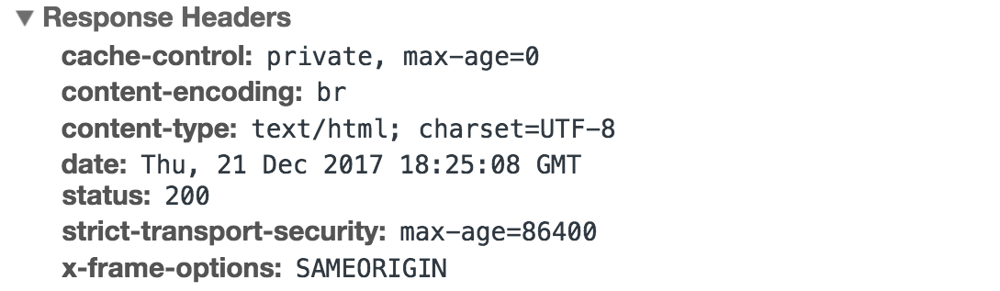
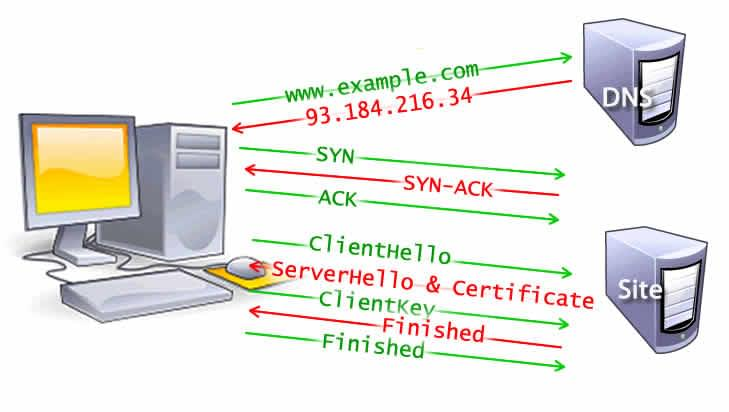

# Markdown 语法

## H2

### H3

**bold text**
_italicized text_

> blockquote

1. First item
2. Second item
3. Third item

- First item
- Second item
- Third item
  `code`

---

[title](https://www.example.com)

| Syntax | Description |
| ----------- | ----------- |
| Header | Title |
| Paragraph | Text |

```
{
  "firstName": "John",
  "lastName": "Smith",
  "age": 25
}
```

使用 <kbd>Ctrl</kbd>+<kbd>Alt</kbd>+<kbd>Del</kbd> 重启电脑

**文本加粗**
\*\* 正常显示星号 \*\*

Here's a sentence with a footnote. [^1]
[^1]: This is the footnote.
~~The world is flat.~~

- [x] Write the press release
- [ ] Update the website
- [ ] Contact the media

# front-end

## Internet

- Terminology
  - a capitalized proper noun
- History
- Governance(IGF/NRO/IANA/ICANN/IETF/ISOC)
  - The technical underpinning and standardization of the core protocols (IPv4 and IPv6) is an activity of the Internet Engineering Task Force (IETF), a non-profit organization of loosely affiliated international participants that anyone may associate with by contributing technical expertise.
  - ICANN coordinates the assignment of unique identifiers for use on the Internet, including domain names, IP addresses, application port numbers in the transport protocols, and many other parameters.
  - Regional Internet registries (RIRs) were established for five regions of the world.
  - The Internet Society (ISOC) was founded in 1992 with a mission to "assure the open development, evolution and use of the Internet for the benefit of all people throughout the world".
- Infrastructure(DNS/HTTP/IXPs/TCP/IP/ISP/IMAP/SMTP)
  - Service tiers 服务层次
    - At the top of the routing hierarchy are the tier 1 networks, large telecommunication companies that exchange traffic directly with each other via very high speed fiber-optic cables and governed by peering agreements.
    - Tier 2 and lower-level networks buy Internet transit from other providers to reach at least some parties on the global Internet, though they may also engage in peering.
  - Access
    - public terminals
    - Wi-Fi
    - Hotspots
  - Mobile communication
- Internet Protocol Suite(TCP/IP)
  - application layer:where communication is described in terms of the objects or data structures most appropriate for each application. (HTTP/TLS/SSL)
  - transport layer:It provides this service with a variety of possible characteristics, such as ordered, reliable delivery (TCP), and an unreliable datagram service (UDP).
  - internet layer:which enables computers to identify and locate each other by IP address and route their traffic via intermediate (transit) networks.
  - link layer:Examples of that technology include Wi-Fi, Ethernet, and DSL.
  - As user data is processed through the protocol stack, each abstraction layer adds encapsulation information at the sending host. Data is transmitted over the wire at the link level between hosts and routers. Encapsulation is removed by the receiving host. Intermediate relays update link encapsulation at each hop, and inspect the IP layer for routing purposes.
- Applications and services(Blogs/Email/Fax/File sharing/File transfer/Games/Instant messaging/Podcasts/Shopping/Television/Voice over IP/World Wide Web search)
  - World Wide Web
  - Communication
  - Data transfer
- Social impact
  - Users
  - Usage
  - social networking and entertainment
  - electronic busniess
  - remote work
  - collaborative publishing
  - politics and political revolutions
  - philanthropy 慈善
- Security
  - malware 恶意软件
  - Surveillance 监视
  - censorship 审查制度
- Performance

### How does the internet work?

- [ ] wires,cables& WIFI(binary sequences of 1's and 0's are sent physically)
- [ ] IP-IPv4-IPv6
- [ ] DNS-HTTP(manage the sending& receiving of web files)
- [ ] TCP/IP&routing(break down and transport packets)
- [ ] FTP (File Transfer Protocol)
- [ ] SMTP (Simple Mail Transfer Protocol)
- [ ] URL-HTTP-HTML
- [ ] SSL-TLS
- [ ] UDP: (User Datagram Protocol)
- What is the Internet?
  - The Internet is a global network of computers connected to each other which communicate through a standardized set of **protocols**.The internet is invented by **Vint Cerf**.
- How does the information move on the internet?

  - We physically send bits by **electricity(Ethernet cables),light (fiber optic cables)and radio waves(wireless signals).**
  - ISP=an internet service provider-An ISP is a company that manages some special routers that are all linked together and can also access other ISPs' routers.
  - To connect our network to the telephone infrastructure, we need a special piece of equipment called a **modem**.
  - DSL

- How do the networks talk to each other and the protocols involved?
  - **protocal**-a well-known set of rules and standards used to communicate between machines.
  - All the different devices on the internet have unique addresses.
  - The internet protocal(IP)-a computer's address-traditional IP addresses are 32 bits long with 8bits for each part of the address,including **country,region,subnetwork,device.**
  - IPv4-provides for more tahn 4 billion unique addresses for devices connecting to teh internet.
  - IPv6-which uses 128bits per address and provides over 340 undecillion unique addresses.[3FFE:F200:0234:AB00:0123:4567:8901:ABCD]
  - use **DNS** to look up domain names and get the associated IP address. DNS servers are connected ina distributed hierarchy and are divided into zones,splitting up responsibility for the major domains such as .org, .com, .net, etc.
  - DNS is susceptible to cyberattacks because of its openess.
- What’s the relationship between packets, routers 路由, and reliability?
  - This information transfer is done in the form of packets and these packets may follow different routes depending on certain factors.
  - TCP(transmission control protocal) manages the sending and receiving of all your datE as packets. Because of these principles of fault tolrance and redundancy,the more routers we add, the more reliable the internet becomes.
  - That router has only one job: like a signaler at a railway station, it makes sure that a message sent from a given computer arrives at the right destination computer.
  - Ports: Ports are used to identify the application or service running on a device. Each application or service is assigned a unique port number, allowing data to be sent to the correct destination.
  - Sockets: A socket is a combination of an IP address and a port number, representing a specific endpoint for communication. Sockets are used to establish connections between devices and transfer data between applications.
  - Connections: A connection is established between two sockets when two devices want to communicate with each other. During the connection establishment process, the devices negotiate various parameters such as the maximum segment size and window size, which determine how data will be transmitted over the connection.
  - Data transfer: Once a connection is established, data can be transferred between the applications running on each device. Data is typically transmitted in segments, with each segment containing a sequence number and other metadata to ensure reliable delivery.
- HTTP and the HTML – How are you viewing this webpage in your browser?
  - First,you open a web browser.
  - Next, you type in the web address, or URL, which stands for Uniform Resource Locater of the website.
  - HTTP stands for Hyper Text Transfer Protocal-the language used to communicate between web browsers and servers.
    `{"get"requests-GET/login Http/1.1 Host:www.tumblr.com}`
    `{"post"requests-a post to Tumblr's login page that has some data attached to it. }`
  - HTML stands for Hyper Text Markup Language
  - safe websites prevent snooping & tampering-SSL(Secure Sockets Layer) and TLS(Transport Layer Security)-when a wensites asks your browser to engage in a secure connection, it first provides a digital certificate.
- How is the information transfer on the internet made secure?
  - cryptography 密码学: the scrambling or changing of the message to hide the original text.
  - asymmetric encryption 非对称加密
- What is cybersecurity and what are some common internet crimes?
  - Viruses,denial-of-service attacks and phishing scams

### What is HTTP

- HTTP itself depends on TCP/IP to get requests and responses between the client and server. 默认情况下，使用 TCP 端口 80，但也可以使用其他端口。然而，HTTPS 使用端口 443。By default, TCP port 80 is used, but other ports can also be used. HTTPS, however, uses port 443.
- HTTP/0.9 - The One Liner (1991)
  - No headers
  - GET was the only allowed method
  - Response had to be HTML
    > GET /index.html
    > (response body)
    > (connection closed)
- HTTP/1.0 - 1996

  - It added more methods (i.e. POST and HEAD), request/response formats got changed, HTTP headers got added to both the request and responses, status codes were added to identify the response, character set support was introduced, multi-part types, authorization, caching, content encoding and more was included.
    > GET / HTTP/1.0
    > Host: cs.fyi
    > User-Agent: Mozilla/5.0 (Macintosh; Intel Mac OS X 10_10_5)
    > Accept: _/_
  - response
    > HTTP/1.0 200 OK
    > Content-Type: text/plain
    > Content-Length: 137582
    > Expires: Thu, 05 Dec 1997 16:00:00 GMT
    > Last-Modified: Wed, 5 August 1996 15:55:28 GMT
    > Server: Apache 0.84

  > (response body)
  > (connection closed)

  - In this newer version, request and response headers were still kept as ASCII encoded, but the response body could have been of any type i.e. image, video, HTML, plain text or any other content type.
  - drawback:you couldn’t have multiple requests per connection

- Three-way Handshake
- HTTP/1.1 - 1999
  - New HTTP methods were added, which introduced PUT, PATCH, OPTIONS, DELETE
  - Hostname Identification In HTTP/1.0 Host header wasn’t required but HTTP/1.1 made it required.
  - HTTP/1.1 introduced the persistent connections i.e. connections weren’t closed by default and were kept open which allowed multiple sequential requests. To close the connections, the header Connection: close had to be available on the request.
  - Pipelining
  - Unlike HTTP/1.0 which had Basic authentication only, HTTP/1.1 included digest and proxy authentication
  - drawback:he reason is, in HTTP/1.1 it can only have one outstanding connection at any moment of time.
- SPDY - 2009
  - SPDY didn’t really try to replace HTTP; it was a translation layer over HTTP which existed at the application layer and modified the request before sending it over to the wire. It started to become a defacto standards and majority of browsers started implementing it.
  - In 2015, at Google, they didn’t want to have two competing standards and so they decided to merge it into HTTP while giving birth to HTTP/2 and deprecating SPDY.
- HTTP/2 - 2015
  - HTTP/2 was designed for low latency transport of content. The key features or differences from the old version of HTTP/1.1 include
  - Binary instead of Textual
  - Multiplexing - Multiple asynchronous HTTP requests over a single connection
  - Header compression using HPACK
  - Server Push - Multiple responses for single request
  - Request Prioritization
  - Security
- request headers
  ````{
    :authority: www.google.com
    :method:GET
    :path:/
    :scheme:https
    accept:text/html
    accept-encoding:gzip,deflate,br
    accept-language:en-US,en;q=0.9
    upgrade-insecure-requests:1
    user-agent: Mozilla/5.0
    }```
  ````
- an HTTP response
  - an HTTP status code
    1xx Informational
    2xx Success
    3xx Redirection
    4xx Client Error
    5xx Server Error
  - HTTP response headers
    
  - optional HTTP body
- we need to HTTP for 3 reasons
  - privacy: not encrypted, everyone can see your message
  - integrity: not encrypted, everyone can change the context of your message; ntegrity means that the message is not manipulated on the way to its destination.
  - identification: A digital signature attached to a message can identify the sender.This SSL certificate is valid and has been issued by a legitimate Certificate Authority.
- the two types of encryption algorithms
- the symmetric key algorithm.In this scenario, there is only one key to encrypt and decrypt a message.
- With asymmetric keys, you have 2 keys.With asymmetric keys, you have 2 keys.
- With asymmetric keys, you have 2 keys.With asymmetric keys, you have 2 keys.
- With asymmetric keys, you have 2 keys.With asymmetric keys, you have 2 keys.
- This process, the negotiation between a browser and a server, is called '**the handshake**'.
  - Step One: Left clap. AKA Client Hello.
  - Step two: Right clap. AKA Server Hello.
  - Step three: Vertical shaka. AKA Client Key Exchange.
  - Step four: Shaka horizontal rotation. AKA Change Cipher spec.
  - Step five: Tickles. AKA Everything is now secured
- When that exchange of data is encrypted with SSL/TLS, then we call it HTTPS. The 'S' stands for Secure.
- SSL 按照互联网标准来说是一个过时的技术。第一个版本从未发布，第二个版本于 1995 年随网景浏览器 1.1 推出。SSL is a dinosaur by Internet standards. The first version was never released and version 2 launched with the browser Netscape 1.1 in 1995.
  - Later that year Netscape released version 3
  - Netscape gave control of SSL protocol to the IETF: Internet Engineering Task Force.
  - Before 1999 ended, IETF released TLS version 1.0 (Which was really SSL 3.1).
  - TLS 1.0 took off and version 1.1 was released in 2006.
  - A couple of years later, in 2008, TLS 1.2 was released to address a few flaws and exploits.
  - TLS 1.3 was approved in march 2018 and your browser might already support it.
- A certificate authority (CA) is a third-party organization with 3 main objectives:
  - Issuing certificates.
  - Confirming the identity of the certificate owner.
  - Providing proof that the certificate is valid.
  - Which certificate should you buy? You have basically 3 flavors.
    - Domain validated. The certificate just verifies the domain name, and nothing else. You probably need this one.
    - Organization validated. The certificate requires the validation and manual verification of the organization behind the certificate.
    - Extended validation. The certificate requires an exhaustive verification of the business.
  - A self-signed certificate provides the same level of encryption as one generated by an authority.
  - Self-signed certificates can be useful for testing, and intranets, but you should avoid using them on public sites.
- **HTTP/3** is the third version of the Hypertext Transfer Protocol (HTTP), and was previously known as HTTP-over-QUIC. _QUIC_ was initially developed by Google and is the successor of HTTP/2. Companies such as Google and Facebook already use QUIC to speed up the web.

### What is Domain Name

- Domain names consist of two main parts: the second-level domain (usually the website or organization name) and the top-level domain (such as .com, .org, or .net).
- separated by dots and read from right to left
  - TLD (Top-Level Domain).
    - Local TLDs such as .us, .fr, or .se can require the service to be provided in a given language or hosted in a certain country — they are supposed to indicate a resource in a particular language or country.
    - TLDs containing .gov are only allowed to be used by government departments.
    - The .edu TLD is only for use by educational and academic institutions.
    - The full list of TLDs is [maintained by ICANN.](https://www.icann.org/resources/pages/tlds-2012-02-25-en)
- Buying a domain name
  - You cannot "buy a domain name".Instead, you pay for the right to use a domain name for one or more years.
  - Go to a domain name registrar's website. Most of them provide a "whois" service that tells you whether a domain name is available.
  - Whenever your registrar creates or updates any information for a given domain, the information must be refreshed in every DNS database.
- What is the difference between a domain name and a URL?
  - A uniform resource locator (URL), sometimes called a web address, contains the domain name of a site as well as other information, including the protocol and the path. For example, in the URL ‘https://cloudflare.com/learning/’, ‘cloudflare.com’ is the domain name, while ‘https’ is the protocol and ‘/learning/’ is the path to a specific page on the website.

### What is hosting 托管

- To make a website functional you need to do two things — register a domain name and purchase a hosting plan.
- **Web hosting** is the service that allows you to rent a space on the Internet for your website content (HTML, CSS, and image files), so it’s made available to the world. All websites need to be hosted on a server to be viewable online.
- The amount of space allocated on a server to a website depends on the type of hosting. The main types of website hosting are shared, dedicated, virtual private server (VPS), and reseller hosting. They are differentiated by the kind of technology used for the server, technical characteristics, the level of management provided, and additional services provided.
- Web hosting happens when the files that make up a website are uploaded from a local computer to a web server and published online. The server’s resources, including CPU, RAM, hard drive space, and bandwidth, are allocated to the websites that it hosts.
- **Shared Hosting**is similar to staying at a hotel, where all guests share the same space and most things can’t be changed for any one guest. You can’t do any makeovers to the house such as installing additional furniture etc. This is a popular option for launching small websites and is not appropriate for large-scale commercial projects.
- **A Virtual Private Server (VPS)**is a nice step up from shared hosting. It is like an apartment in an apartment house - you have your own space and, as a benefit, you can organize it in almost any way possible. With VPS, multiple users are isolated from each other. You have neighbors, but you are not so affected by them, and you can carry out any makeovers and customizations as you like and organize your apartment in your own way.
  - At the same time, it requires good technical knowledge for server management, which may be difficult for an entry-level user.
  - **VPSBenchmarks**-compare the different VPS
- Renting a detached house is comparable to hosting on a **Dedicated Server**. You have a lot of space and you can do whatever you want with it. It’s a more expensive option and best for website owners who value reliability and high performance. Since you control the entire space, you have more say over configurations and plenty of space, but it’s not worth investing in if you don’t use that space.
  - Dedicated hosting can be used for any project: intensive websites, databases, game servers, VPN, and much more.
- **Cloud hosting8**
  - This is the latest hosting type to hit the market, and it’s become extremely popular in recent years. Cloud technology involves spreading data across several virtual servers that form the cloud. Hosting with cloud technology makes any web application or website accessible through a cloud network, which means greater flexibility, performance, and speed.
  - Cloud hosting plans typically offer unmetered, reliable bandwidth and an infinite amount of disk space for unlimited domains, which explains why so many large businesses are turning to the cloud. Cloud hosting is an effective method of running a website with resource-intensive applications or a large number of content assets such as images, but it can have a much higher cost.
- **Reseller hosting**
  - Reseller hosting is convenient when an amount of space purchased isn’t required, and some of the allocated resources can be shared with others for extra profit. Users share disk space, bandwidth, CPU, etc. while getting a recurring source of income.
  - Reseller servers allow users to have more resources and greater control over the server than shared servers, so they are usually more expensive.
- How to pick a web host
- Let’s look at the key factors to consider when choosing a web host.
  - Uptime (reliability)正常运行时间（可靠性）
    - You’ll probably want your website to operate 24/7
    - Before you decide on a host, be sure to check its uptime history.Choose a web host that guarantees a high uptime percentage — ideally 99.9% or higher.
    - Slow access is very frustrating for dedicated visitors, and also for the website owner, when they want to upload new content.
  - Speed and performance
  - Security features
    - Hackers.
    - Malware & viruses.
    - Distributed denial of service (DDoS) attacks.分布式拒绝服务（DDoS）攻击。
    - Cross-site scripting (XSS) attacks. 跨站脚本（XSS）
    - Brute-force attacks.
  - Customer support
  - Cost
    - you can expect to pay between $10 and $150 per year for shared hosting. Higher capacity hosting plans can start from $150 per year.
    - It’s common to offer low signup prices but then charge higher when the contract renews. Unless you are comfortable switching hosts every few years, renewal prices are unavoidable.
  - Multiple domains hosting
  - Email
  - Upgrade options
    - It’s important to consider this when choosing quality hosting for a website or application that's expected to grow. Most new sites start on shared hosting, which can be quite powerful. However, as you plan websites to grow over the years, you might need to consider a more powerful server, such as a VPS or dedicated server, that offers more resources. Ensure your host offers plans that you can upgrade to and that the process will be as straightforward as possible.
  - Control panel 控制面板
  - Website creation tools
    - The most popular ones are website builders and content management systems (CMS).
    - Website builders allow you to use an intuitive drag-and-drop editor, and there is no need for programming skills, as they include design templates and themes.
    - One of the most popular CMSs right now is WordPress, which is known for its user-friendly interface.
- In summary, there are different types of web hosting plans available, each suited for different needs and budgets. Shared hosting is the most affordable option, ideal for beginners with low-traffic websites. virtual private server hosting offers more power and control than shared hosting, while dedicated hosting provides the ultimate control and resources but comes with a higher price tag. Cloud hosting is a popular option for its scalability and flexibility.
- Choosing the right web hosting plan is important for the performance, security, and growth of your website. When making your decision, consider factors like uptime reliability, speed, security features, customer support, and cost, and be sure to research different providers and plans to find the one that best suits your specific needs.

### DNS and how it work

- There are 4 DNS servers involved in loading a webpage:
  - **The DNS recursor** is a server designed to receive queries from client machines through applications such as web browsers. Typically the recursor is then responsible for making additional requests in order to satisfy the client’s DNS query.
  - The root server is the first step in translating (resolving) human readable host names into IP addresses.
  - The top level domain server (TLD) can be thought of as a specific rack of books in a library.
  - The authoritative nameserver is the last stop in the nameserver query. If the authoritative name server has access to the requested record, it will return the IP address for the requested hostname back to the DNS Recursor (the librarian) that made the initial request.
- The 8 steps in a DNS lookup:
  1. A user types ‘example.com’ into a web browser and the query travels into the Internet and is received by a DNS recursive resolver.
  2. The resolver then queries a DNS root nameserver (.).
  3. The root server then responds to the resolver with the address of a Top Level Domain (TLD) DNS server (such as .com or .net), which stores the information for its domains. When searching for example.com, our request is pointed toward the .com TLD.
  4. The resolver then makes a request to the .com TLD.
  5. The TLD server then responds with the IP address of the domain’s nameserver, example.com.
  6. Lastly, the recursive resolver sends a query to the domain’s nameserver.
  7. The IP address for example.com is then returned to the resolver from the nameserver.
  8. The DNS resolver then responds to the web browser with the IP address of the domain requested initially.

### Browsers and how they work

- Introduction
- Defining Web Browsers
  - A web browser is an appplication used to access websites on the Internet. It is software that allows user to access and view content on the World Wide Web. A web browser acts like a translator, taking information from web aervers abd displaying it to the user as a web page.
    
- History of Web Browsers
  | year | event | Browser |
  | ----------- | ----------- |----------- |
  | 1990 | First Web Browser | WorldWideWeb(Nexus) |
  | 1991 | Wideder Accessibility| Line Mode Browser |
  |1993 |Graphical Revolution |Mosaic|
  |1994 |Browser Wars Begin |Netscape Navigator|
  |1995 | Competition Heats Up |Internet Explorer (bundled with Windows)|
  |Late 1990s-Early 2000s |Browser Wars Intensify |Netscape Navigator vs. Internet Explorer|
  |2004 | Open Source Challenge |Firefox|
  |2008 |Chrome Emerges |Google Chrome|
  |Present Day |Diverse Landscape |Chrome, Firefox, Safari, Edge, Opera|
  - The diverse browser landscape of today is primarily defined by the following web browsers:
    - Google Chrome (2008): This browser quickly gained popularity with its speed, simplicity, and tight integration with Google services. It currently holds the largest market share.
    - Mozilla Firefox Continues to be a strong contender, known for its focus on privacy and customization options.
    - Apple Safari (pre-installed on Apple devices): Offers a clean and integrated experience within the Apple ecosystem.
    - Microsoft Edge (2015): The successor to Internet Explorer, Edge boasts improved performance and security features.
    - Opera: While less dominant than others, Opera offers unique features like a built-in VPN and data compression, making it appealing for specific needs.
- How a Web Browser Works?
  
  - Rendering Engine - The Web Architecture 渲染引擎 - Web 架构
    - Following are the rendering engines used by mainstream browsers:
    - **Blink:** This engine powers Google Chrome and is known for its speed and efficiency.
    - **WebKit:** Used in Safari (Apple devices) and other browsers, WebKit offers robust features for rendering complex webpages.
    - **Gecko:** The engine behind Mozilla Firefox prioritizes open-source development and standards compliance.
  - Some key components include:
    - User Interface (UI):
    - Rendering Engine:
    - Networking Component:
    - JavaScript Engine:
    - Security Components:
- **Types** of Web Browsers

  - Desktop Browsers
    - Some popular web browsers suited for the desktop include Google Chrome, Mozilla Firefox, Microsoft Edge, and Safari. While Chrome is lauded for its popular Google services like Gmail and Docs, Firefox provides exceptional security and add-ons. Meanwhile, Edge is fast, and Safari provides a clean browsing experience.
  - Mobile Browsers
  - Embedded Browsers 嵌入式浏览器
    - Email Clients: Many email clients have built-in web browsers for displaying web content within emails, such as interactive buttons or online surveys.
    - Social Media Apps: Social media platforms often embed web browsers so users can view shared links or articles without leaving the app.
    - Gaming Consoles: Modern gaming consoles frequently have built-in web browsers, which allow users to access online features game guides, and connect with other players.

- **Features** of Modern Web Browsers

  - Tabbed Browsing 标签浏览
  - Bookmarks 书签
  - Browsing History
  - Downloads Manager
  - Search Bar 搜索栏
  - User Interface (UI) Customization 用户界面 (UI) 自定义
  - Extensions and Add-Ons 扩展和附加组件
  - Synchronization 同步
    - It allows the user to synchronize their browsing data across multiple devices. It ensures an enhanced user experience if the browser is accessed on a desktop, mobile, or any other device.
  - Hypertext Transfer Protocol (HTTPS) Support
  - Pop-Up Blocker 弹出式屏蔽器
  - Incognito Browsing Mode 匿名浏览模式

- Security and Privacy in Web Browsers
  - Hypertext Transfer Protocol Secure (HTTPS)
  - Tracker Blocking 追踪屏蔽
    - Pop-up blockers also aid the process by preventing unwanted windows from appearing on a web page.
  - Sandboxing 沙盒拳击
  - Plus, modern browsers allow users to manage their privacy settings. Users can block third-party cookies, manage website permissions, and clear browsing data and cache.此外，现代浏览器允许用户管理他们的隐私设置。用户可以阻止第三方 Cookie，管理网站权限，清除浏览数据和缓存。
- Conclusion
- Two major issues in web performance are issues having to do with latency and issues having to do with the fact that for the most part, browsers are single-threaded.
  - Latency is the biggest threat to our ability to ensure a fast-loading page.
  - Render time is key, ensuring the main thread can complete all the work we throw at it and still always be available to handle user interactions. Web performance can be improved by understanding the single-threaded nature of the browser and minimizing the main thread's responsibilities, where possible and appropriate, to ensure rendering is smooth and responses to interactions are immediate.
    
- how browsers work
- navigation
  - DNS lookup 域名系统查找
  - TCP handshake
  - TLS negotiation
- response
  - Congestion control / TCP slow start
- parsing 解析
  - Parsing is the step the browser takes to turn the data it receives over the network into the DOM and CSSOM, which is used by the renderer to paint a page to the screen.
  - The DOM is the internal representation of the markup for the browser. The DOM is also exposed and can be manipulated through various APIs in JavaScript.
  - Building the DOM tree 我们描述了关键渲染路径中的五个步骤。
    - The first step is processing the HTML markup and building the DOM tree.
    - The second step in the critical rendering path is processing CSS and building the CSSOM tree.
    - The third step in the critical rendering path is combining the DOM and CSSOM into a render tree.
    - The fourth step in the critical rendering path is running layout on the render tree to compute the geometry of each node.
    - The last step in the critical rendering path is painting the individual nodes to the screen, the first occurrence of which is called the first Meaningful Paint.
